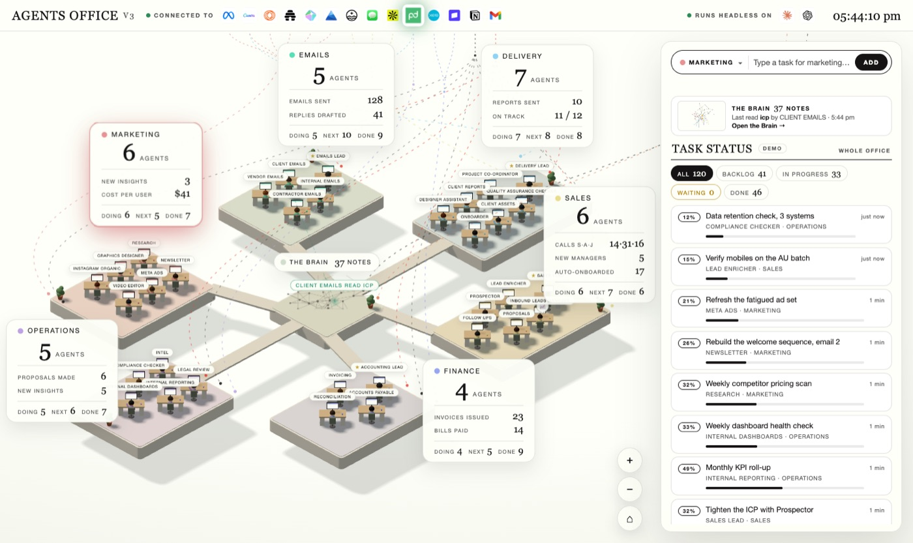
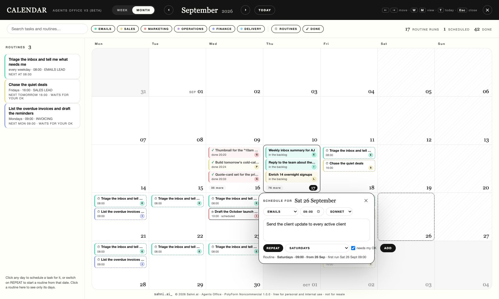

# Agents Office



A 3D isometric office where AI agents do real work on your own Claude login.

Six departments, thirty-five agents at their desks, a task bar that routes what you type to the
right agent, and a Brain at the centre that is your own folder of notes. 

Type a task, the office
gives it to the right person, they read your notes, use the connectors you have already set up
in Claude Code, do the work, and file the result back into your notes. Everything runs on your
machine.

**Beta.** It works end to end. Expect rough edges and tell us about them in Issues.

> **Abrinay · PanaClaw** (https://panaclaw.com): interfaz en español, configuración para el negocio
> PanaClaw (brain en `brain-panaclaw/`, 35 puestos, skills y rutinas) y la oficina servida sin
> simulación de demostración. El producto original, su marca y su licencia son de Sahni.ai.

**License, in plain English:** Agents Office is a Abrinay product. It is free for personal and
internal use. You may not sell it, resell it, or build a paid product on it. You may not rename it,
rebrand it, strip the Abrinay mark or the notices, present it as your own, or wire it into or bundle
it with another product, agent system or workforce. (Formal terms: PolyForm Noncommercial 1.0.0 plus
Abrinay additional terms — see [LICENSE](LICENSE).) The page carries the Sahni.ai mark at the
bottom-left and a licence line along the bottom; leave them in place.

## Latest updates

- **V4.9: Dimitri runs the Estudio for you** — 30 Sep 2026 · Ask Dimitri (key **S**, now in every view, beside it instead of over it) for creatives — «hazme 4 creativos para el lanzamiento, estilo de esta foto, formato reel» — and attach, drop or paste up to 4 images: he **sees them** (Claude's own vision), reads your brand voice, figures, offer and the creatives you approved before, picks real models from your catalog (only the ones switched on) and says why, writes production prompts, and shows a **plan of creatives** you can edit, with its cost against your caps. **Nothing is generated until you press GENERAR**; then he organises the folders and tells you in his chat when they are ready, with the thumbnails. He also knows what you are looking at (the picture in the viewer, the note, the piece, the day). In the Estudio: the viewer **never cuts a large picture** (a 9:16 photo showed 43 % of itself), with zoom, pinch, drag, 100 % and **F** for full screen; **Editar** makes a new version of a picture from a sentence, beside the original, which is never touched; «Pedírselo a Dimitri» and «Mandar a un departamento…» on every picture. Every creative leaves a note in the Brain, and what you use teaches the memory.
- **V4.8: Meta in the Estudio** — 30 Sep 2026 · With your Meta key (`META_API_KEY`, or the `MODEL_API_KEY` you already use for Muse Spark) the Estudio gets **Muse Image**: it generates and edits (up to 10 references), looks up real references on its own (brands, places, today's data) and costs US$0.01 an image. And the agents can now **watch a video or listen to an audio** with Muse Spark — `analizar_video` (describe, summarise, what is said) and `transcribir_audio` — on anything in the gallery, which now takes mp3 and wav too. Meta does not generate video; that stays with Veo, Kling and Seedance.
- **V4.7: Contenido — what you publish, on a calendar** — 30 Sep 2026 · A new view in the top bar (key **K**, the calendar-with-a-picture icon): the calendar of what goes out on Instagram and Facebook. Every piece is a note (`<brain>/Agents Office/contenido/`, never uploaded to GitHub) with its day, hour, format, networks, pictures from the Estudio and its text; it sits on the same month, week, day and agenda grids as the task calendar, drags to another day, and the ideas without a day wait on the left. A side panel writes the piece — text, hashtags, first comment, pictures (**Elegir del Estudio**, **Crear con el Estudio**), a preview — and says, with the networks' own limits, whether it **can go out** and how to fix what cannot. **Programación** lists what waits for your OK, what you approved and what is still a draft. Marketing's agents read the calendar and **leave drafts** (a `plan-contenido` skill teaches them how); they cannot approve, schedule or publish, and changing what goes out of an approved piece takes its approval away. An image in the Estudio can be sent to the calendar («Enviar al calendario»), and the Estudio will not trash a file a piece uses. The task calendar can show the pieces as a layer. **Nothing is sent to Meta:** scheduling in Meta is the next phase ([docs/propuesta-contenido-y-meta.md](docs/propuesta-contenido-y-meta.md)). On a phone, Analíticas, Salud, Negocio and Ajustes fold into one «⋯» so the dock fits.
- **V4.7 (F2): Analíticas — how Instagram and Facebook are doing** — 30 Sep 2026 · A second new view in the top bar (key **R**, the bar-chart icon; on a phone it is in «⋯»). **Read only:** it connects to Meta with the token of a Business Manager *system user* (`META_ACCESS_TOKEN`, a Windows environment variable — never a file) and never publishes or changes anything there. Once a day, from 6:00, it writes down yesterday for each account (Meta keeps little history, so what is not written down is lost) and shows followers, reach, views, interactions and profile visits against the previous period, the evolution as a line, which format and which day and hour work best (with a suggested hour only when there is enough data), and the posts that moved most. It says what it does not know: figures that have not matured, permissions the token lacks, a comparison with nothing to compare to. Followers and reach can go to **Cómo va el negocio**, and the Salud light has a «Redes (Meta)» row. Without a token it shows how to connect and a «datos de ejemplo» preview, always labelled. **Written and tested against a fake Graph API; not yet tried against Meta itself.**
- **V4.6: a Brain you can turn, and a memory that learns** — 27 Sep 2026 · The Brain is now a 3D neural network: every note a neuron, every link a synapse, each folder a lobe (the folders that link to each other share a hemisphere), the hubs in the middle and the details towards the cortex. It turns slowly on its own and stops when you touch it; drag to turn, wheel or pinch to zoom, arrows on the keyboard. A click on a neuron — or on its name — opens its card, which now hides or closes without closing the Brain; the pointer shows a preview of the note. «Explorar» on the left: search, regions, when, who, synapses, connections (hubs or loose notes), the neighbourhood of a note, the tools and a list of every note for the keyboard. Behind it, the memory, after studying cognee, Graphiti, Mem0, HippoGraph, company-brain and Engram, with no extra model calls: a note that names another without linking it is connected anyway (60 such links in PanaClaw's brain), the best notes bring their neighbours as a summary, what an agent reads fits a budget with no near-copies, and **synapses learn** — notes cited together in work you approved grow stronger (gold in the Brain), work you sent back weakens them, unused ones fade in a few months. Clicking the business name in the top bar now also flies back to the whole office. **Folders in the Estudio:** make one, name it, drag pictures onto it (or «Mover a…» for several at once); what you generate or upload while a folder is open lands in it; removing a folder never deletes a picture.
- **V4.5: one bar to get around, your theme, Estudio caps in Settings** — 27 Sep 2026 · The Estudio, the calendar and the Brain are views under a top bar that never goes away: one is open at a time, and a click on another icon (or E, P, G) switches to it — the calendar used to stay shut while the Estudio was open, and the calendar and the Brain covered the bar. The Brain has its own icon in the dock, and your business name takes you home. Settings (key `,`) gain **Apariencia** — Claro (the default), Oscuro or Automático, which follows your system — and **Atajos de teclado**, the list `?` still opens; the keyboard button and the D key are gone. Opening Dimitri brings the centre closer, beside his chat, and the Brain and Dimitri grow as you come near instead of shrinking. Every Estudio card has **Usar de referencia** beside Animar, Descargar and the bin. The Estudio's caps live in **Settings → Estudio**: generations a day (0 = no cap) and, new, a spending limit in US$ a day and a month, checked before anything is sent.
- **V4.4: Google video, and an Estudio that is easier to read** — 27 Sep 2026 · With the same `GEMINI_API_KEY` as Nano Banana you now get Nano Banana 2, 2 Lite and Pro, and **video with Veo 3.1, Fast and Lite** (sound included; Veo needs billing on the AI Studio project). The viewer shows the picture and its text side by side, never one over the other. Each card has Animar, Descargar and the bin as icons, the rest under «⋯». The model list sorts by quality, price, speed or maker, filters by maker and says what each model is for.
- **V4.4: every Higgsfield model, built from its own documentation** — 25 Sep 2026 · The Estudio's Higgsfield catalog now comes from Higgsfield's published schemas: 53 models (Cinema Studio 4.0, Marketing Studio, Kling O3/O1 with references and video edit, Genjutsu, Recraft Pro/Utility, Qwen edit, LTX from an image, and more), and every request carries only fields and values Higgsfield accepts — 37 kinds of request used to be refused. Card actions no longer cover the picture; the Estudio has a **Papelera** you can open (recover or delete for good within 30 days); a new picture never shows an old one.
- **V4.4: an office that knows your business** — 25 Sep 2026 · Settings (key `,`) replace the JSON files: security, approvals, costs, notices, connectors, quality and your team, plus your company's figures (prices, commissions, goals the agents use as they are), your brand voice, and «set it up from my website». Drop a PDF, Word, Excel or CSV on the Brain and it becomes a note every agent can read; the Brain searches by passage, and by meaning when an embeddings key is present, and flags notes that may be out of date. «How the business is doing» (key N) tracks your own indicators (by hand, by webhook, or from a line `KPI id = value` in a deliverable). Tasks can go to a person on your team, carry comments with @mentions, and a job you liked can be saved as an example for that agent. Ctrl+K searches everything; Dimitri sends a Monday summary; `Instalar-Oficina.bat` installs the office on a new Windows PC (`docs/instalar.md`).
- **V4.4: approvals you can trust, work that gets better** — 25 Sep 2026 · A draft waiting for the OK shows what will go out (channel, recipients, subject, amounts, attachments) and its risk; you can edit it by hand, approve with 30 seconds to undo (in the page and on Telegram), approve all at once, and see who approved what. Drafts remind you after a day and expire after a week without sending. Any amount over your limit always waits for the OK. A routine approved 20 times in a row without changes can earn the right to send alone. Delegated approvers on Telegram act only for their departments. Quality per desk (first-try approvals, send-backs, 👍/👎) with a warning when a skill change makes it worse; every version of a skill or a brief is kept and can be restored; lessons fold their duplicates; the department lead reviews sensitive work before it reaches you; deliverables name their sources; and the router learns from the tasks you move.
- **V4.4: what it costs and what it saves** — 25 Sep 2026 · Every model call is priced and logged (`data/costs.jsonl`): what Claude Code reports for Claude, a dated price table for Meta, DeepSeek, Kimi and GLM through an Anthropic-compatible endpoint, the Estudio's jobs as estimates. «Costos y retorno» (key U) shows the month, cost per task, hours saved and their value, eight weeks, departments, desks and models, a monthly budget with a warning (and an optional stop), one-click suggestions (a cheaper model where the work is short and approved as it comes, a stronger one where it keeps coming back, pausing a routine nobody reads) and the month as CSV for the accountant.
- **V4.4: the office on your phone, and work that starts by itself** — 25 Sep 2026 · Dimitri on Telegram: approvals arrive with ✅ Approve / ↩ Send back buttons, failures with ↻ Retry, the office's notices as messages, quiet hours hold what is not urgent, and any other text goes to Dimitri (`/estado`, `/pendientes`, `/tarea`, `/silencio`). It polls Telegram from your own PC, so nothing is exposed; the token and the allowed ids live only in environment variables (`docs/telegram.md`). Triggers turn events into tasks the moment they happen — a web form, a Stripe payment, a WhatsApp, an email forwarded by Zapier / Make / n8n — through `POST /api/hook/<id>` with a secret token; what arrives is handed to the agent as data, never as orders (`docs/disparadores.md`).
- **V4.4: an office that recovers on its own** — 25 Sep 2026 · A failed run retries itself when the failure is passing (network, overload, a timeout with more time, Claude's usage limit after it resets) and says so on the card; a lost login stops and explains how to sign in again. A routine missed while the computer slept runs once on waking, and a notice says how many were missed. A traffic light in the dock (key O) shows Claude, connectors, disk, routines, queue, approvals, failures, security and the daily copy, with the office's notices. A damaged tasks file comes back from the daily copy; `Volver-Atras.bat` undoes a bad update. A `Dockerfile` and `railway.json` are ready for a future move (`docs/despliegue.md`).
- **V4.4: agents with locks, not promises** — 25 Sep 2026 · A hook (`guard.mjs`) checks every tool call an agent makes. By default nothing is sent, posted, paid or deleted except in the run after your OK, and a task that tries to send without it waits for you with its draft. After the OK, a send can only reach the addresses in the approved draft. An email or web page carrying hidden orders stops every send in that run and is flagged in the task. The agents' Chrome can be limited to allowed sites, and each desk and each address has a daily cap. Every tool call is logged in `data/audit/`. `npm test` covers the rules; a pre-commit hook and `npm run secrets` keep keys, cards and ID numbers out of the repository; GitHub Actions runs everything on each push. Settings: `office.config.json → safety`.
- **V4.3: accessible everywhere** — 25 Sep 2026 · A deep audit of logic, UX, performance and connections, and the 30 most critical visual accessibility errors fixed: every field shows the focus ring, paused and skipped work stays readable, targets are at least 24 px, no text under 10.5 px, the Estudio fits a 320 px screen, and no button sits inside another. axe-core finds no critical failures, no nested controls and no low contrast in 19 views, light and dark. The audit: [docs/auditoria-profunda-2026-09-25.md](docs/auditoria-profunda-2026-09-25.md).
- **V4.2: a calendar with hours, a gallery that keeps still** — 24 Sep 2026 · The calendar's week and day are one time grid, 00:00 to 24:00, with a red line at «now»; a click on an hour schedules at that hour. The month shows one line per event and «+N más» instead of cutting cards in half. Dates and times are in Spanish whatever the browser's language. Cards drag with a finger on a tablet or phone (hold, then move). A router answer that is not JSON gives the task to the department lead instead of losing it. In the Estudio the gallery reads in rows, newest first, and is updated in place, so a playing preview and the keyboard focus survive the refresh; an empty idea is flagged on the field; the footer says the format and the length; a model without its key explains the three steps and offers the free test engine; on a phone the Estudio has «Crear | Galería» tabs. A phone opens the calendar on the AGENDA (a list by day; key A anywhere). Past routine runs show what happened: done ✓, failed ⚠, skipped, or «no corrió» when there is no task for a run. Each gallery card has the star, one action in words (Animar, or Repetir for a video) and a «⋯» menu with the rest, the bin last; on a touch screen only «⋯» shows. «Mejorar el prompt» says its language: in English (with the Spanish reading under it) or in Spanish, remembered. A job that finishes while the Estudio is closed puts a count on the clapperboard in the dock and a note with VER. The routine's window shows its whole title and every action in two rows. Cancelling a task or deleting a routine in the calendar happens at once with DESHACER for 8 seconds. A running job says how long that model usually takes, with a bar; cancelling one already sent to a paid engine asks, in the tile, whether to go ahead. The enlarged view says «3 de 8» and has Variar: the same prompt with the picture as the reference. The gallery is split by day, one request's pictures share one card (Ver por separado, Descargar las N), and an agent's picture names the task it was for. A routine's days are seven toggles, and dragging one run asks «solo esta vez» (that run is skipped and a one-off task, same desk, takes its place) or «siempre». Work under way sits in a «SIN TERMINAR» strip; messages appear at the bottom, beside the work; the counts are filters; the week can start on Sunday and shows its number; the routines are searchable and grouped by department (a click opens one, 👁 shows only its days); the search lists its results with their dates; «Suscribirme (.ics)» gives a read-only feed at `/api/calendar.ics` for the owner's own calendar app. In the Estudio every model is listed (the ones without a key dimmed, with how to turn them on), «Una idea / Varias ideas» is a switch with its count, costs from US$0.50 ask first, the same request twice needs a second click, uploads show a percentage, the tabs show their counts, a Historial lists every job of the week with its reason, the composer folds, and Ctrl+Enter, / , I and V are in the «?» sheet. The audit is [docs/auditoria-estudio-calendario-2026-09-24.md](docs/auditoria-estudio-calendario-2026-09-24.md).
- **V4.1: a cleaner centre, safer approvals, every screen size** — 24 Sep 2026 · The centre of the office is now the Brain's icon and Dimitri, without the web of lines. Each approval card acts on its own draft; REJECT asks for the note on the card; the ⚠ counts drafts. The panel has ARCHIVADAS and DESHACER. Windows keep the keyboard inside them; `?` lists every key. On a laptop, tablet or phone the department cards fold to one line and the office fits the screen. Dark mode passes AA contrast. The last 31 points of the UX audit are fixed, and a visual audit of 50 more is in [docs/auditoria-visual-2026-09-24.md](docs/auditoria-visual-2026-09-24.md).
- **V4: order and room to grow** — 24 Sep 2026 · The mouse wheel scrolls every panel again (the 3D view used to take it everywhere). A calm top bar: your business name, the connectors in their own lane with a panel that says which work and which need attention, a fixed dock of icon tools (Estudio, calendar, the task panel's switch). Dimitri, your right hand, sits beside the Brain and talks, reports, analyses — and splits work only when there is work. The Brain filters by folder, date, author and department and searches the text of every note. «el viernes a las 10, …» schedules one task; «cada viernes…» makes a routine. The UX audit: [docs/auditoria-ux-2026-09-24.md](docs/auditoria-ux-2026-09-24.md).
- **The Estudio (E)** — 24 Sep 2026 · Real images and video, by hand or by the agents: Higgsfield (Soul, Kling 3, Seedance), Nano Banana, GPT Image, Grok and fal.ai, 52 models with their own settings (38 on Higgsfield, the whole open-higgsfield catalog); start/end frames, references and your own uploads; «Animar» turns any image into a video; jobs run in the background and survive a restart; a masonry gallery with multi-select, ZIP and undo. → [The Estudio](#the-estudio-images-and-video-for-real)


- **The calendar (P)** — 17 Sep 2026 · Everything on the day it belongs to: finished tasks, today's work, tasks you have scheduled, and every routine projected forward. Click any day to schedule a task for it, or switch on REPEAT to start a routine from that date. A rail lists the routines themselves. Month and week, dark mode too. → [The calendar](#the-calendar-everything-on-the-day-it-belongs-to)
- **Agent Teams** — 16 Sep · Press TEAM or say "as a team": the department lead splits the job across its desks, they work at the same time, leave notes for each other, and the lead writes the final. → [Agent Teams](#agent-teams-the-lead-splits-it-across-the-desks)
- **Claude in Chrome** — 16 Sep · The agents can use your own browser for any site you are signed in to, under the same read-freely, act-only-when-asked rule. → [Claude in Chrome](#claude-in-chrome-the-agents-can-use-your-browser)
- **Models by name, effort, and the usage gauge** — 9 Sep · Sonnet, Opus or Fable per task, routine, agent or office; an effort menu; your plan's session and week in the top bar. → [Which model](#which-model-and-how-much-of-your-plan)
- **Routines** — 9 Sep · Tasks on the office's own clock, with "needs my OK" before anything goes out. → [Routines](#routines-the-office-runs-on-its-own-clock)
- **The lead interviews you, and the agents learn from corrections** — 7 Sep · Say "set up" to a department lead; every `revise: …` becomes a standing rule. → [Teach the agents](#teach-the-agents-how-you-work)

The full list, release by release: [CHANGELOG](CHANGELOG.md).

## Trabajar en equipo (PanaClaw)

Cada persona de PanaClaw mejora la oficina en su propia computadora, con su propia sesión de Claude Code, y sube su trabajo a este repositorio. El dueño lo trae con un doble clic.

1. **Quien trabaja:**
   - trae lo último (`git pull`);
   - trabaja en una rama;
   - deja `npm run check` en verde;
   - abre un Pull Request hacia `main`.
2. **El dueño** acepta el Pull Request y hace doble clic en **`Actualizar-Oficina.bat`**. El archivo:
   - guarda sus cambios propios (rutinas, agentes, notas);
   - trae lo nuevo e instala librerías si hace falta;
   - abre la oficina con el iniciador.

   Si dos personas tocaron la misma línea, no cambia nada y lo avisa.
3. **Qué viaja y qué no:**
   - Por GitHub va el código, la configuración del equipo (`office.config.equipo.json`), las notas de empresa y el roster, las rutinas y las skills del cerebro.
   - Cada máquina se queda con `data/` (tareas e historial), `office.config.local.json`, las entregas de los agentes, las imágenes del Estudio y las keys (siempre en variables de entorno de Windows, nunca en un archivo).

Las reglas completas están en [CLAUDE.md](CLAUDE.md), en la sección «Trabajo en equipo»; el Claude de cada persona las lee solo. Lo que queda por hacer está en [docs/auditoria-ux-2026-09-24.md](docs/auditoria-ux-2026-09-24.md).

**¿Solo sirve el `.bat`?**
- En Windows, `.bat` y `.cmd` son lo mismo y funcionan con doble clic.
- Un `.ps1` (PowerShell) Windows lo bloquea por defecto al hacerle doble clic.
- Para un ícono bonito, crea un acceso directo al `.bat` en el escritorio y cámbiale el ícono.
- En Mac el equivalente es un `.command`; en Linux, un `.sh`.
- En cualquier sistema también sirve `npm start`.

## What you need

- macOS or Linux (Windows: works with `npm` commands directly, `./setup` is Bash only)
- Node.js 20+ — https://nodejs.org
- git
- **Claude Code**, logged in with your Claude account, or an `ANTHROPIC_API_KEY`

## Install

```bash
git clone https://github.com/ajsahni/agents-office.git
cd agents-office
./setup          # checks Node, git and Claude; installs; builds; boots once
npm start        # → http://localhost:4520
```

Without `./setup`: `npm install && node build.mjs && npm start`. On a new Windows PC, double-click `Instalar-Oficina.bat` (installs Node, Git and Claude Code, clones, installs and leaves a desktop shortcut; `docs/instalar.md`).

## First five minutes

1. Open http://localhost:4520. The panel on the right says **LIVE · CLAUDE** when the server is
   connected. Double-clicking `dist/command-centre-v2.html` opens the same office on its own,
   without a server, in demo mode.
2. In the bar at the top of the panel, pick a department, type a task in plain words, press **Add**.
   Claude picks the agent and names them; the task appears in the feed; the agent picks it up,
   works, and the deliverable lands in that agent's chat and in your brain folder as a note.
3. Click any agent to talk to them. They answer in their role, grounded in your notes.
   Say `revise: make it shorter` and they rework their last deliverable.
4. Press **G**, or click the Brain, to open your notes as a graph. Hover a note to see its links,
   click it to read where it sits and who read or wrote it.
5. The top bar shows the connectors your Claude Code is connected to. When an agent uses one,
   its logo pulses and the wire into that department lights up.
6. The first deliverables will be competent and generic: the agents know the sample studio and
   one sentence about their own job. Point the brain at your notes, then teach them how you
   work (below). That is where the office becomes yours.

## Connectors

The bar under **CONNECTED TO** is real: it is the list from `claude mcp list` on this machine,
which is the same list the agents get as tools. Gmail, Slack, Notion, Google Drive, Canva,
whatever you have connected in claude.ai or added with `claude mcp add`. A server that needs
authentication shows grey with the reason on hover, and is not wired to any pod until it works.
Nothing connected yet? The bar says so.

Agents can call those servers while they work, plus web search. They never get Bash, file
tools or sub-agents. Their standing rule: read freely; send, post, pay, delete or change
anything outside this machine **only** when your task explicitly asks for that exact action.
A finished deliverable says which tools it used, and the note in your brain records them.

Decide what the agents may touch in `office.config.json`:

```json
"mcp": { "allow": [], "deny": ["Stripe"], "departments": { "Slack": ["emails", "ops"] } },
"tools": { "web": true, "browser": true },
"teams": { "enabled": true, "max": 4 }
```

`allow` empty means every connected server. `deny` keeps a server in the bar but out of the
agents' hands (`"deny": ["Chrome"]` works the same for the browser). `departments` says which pods
a server is wired to (known brands have a default; anything else feeds every pod). Set `tools.web`
to `false` to keep the agents off the web, `tools.browser` to `false` to keep them out of your
Chrome (see [Claude in Chrome](#claude-in-chrome-the-agents-can-use-your-browser)).
Tool use needs the Claude Code login; on an `ANTHROPIC_API_KEY` the agents write from your notes only.

## Make the agents yours

The 35 agents are in `office.agents.json`: an id, a department, a name, a role, what they do,
and the connectors they usually use. Change the name, the role, what they do and their tools.
Departments, leads and seats are fixed: six pods, 35 desks, that is the office. A new kind of
agent is a renamed seat in the right department.

The easy way is to let Claude do it. Open Claude Code in this folder and say what you want:

```
claude
> Rename the Newsletter agent to PODCAST NOTES. It turns each episode into show notes and a LinkedIn post, and uses Google Drive.
> Make the Sales department about wholesale accounts, not inbound leads. Rewrite what each agent does.
> Tell every Finance agent to use Xero and nothing else.
```

Claude reads `CLAUDE.md`, writes your changes to `office.agents.local.json` (yours, ignored by
git, so `git pull` never overwrites it), and validates them with `npm run check`. Restart the
office and the desks carry the new names. Edit the file by hand if you prefer; the shape is:

```json
{ "agents": [
  { "id": "newt", "name": "PODCAST NOTES", "role": "Podcast Notes Agent",
    "does": "Turns each episode into show notes and a LinkedIn post.", "tools": ["google drive"],
    "brief": "Show notes are five bullets and a pull quote. The LinkedIn post opens with the quote, never with the episode title." }
] }
```

Edits to `id`, `department` or `lead` are ignored, and the server says so at start. The same
file can also sit in your brain as `<brain>/Agents Office/agents.json`; the office reads the
shipped roster, then the brain's, then the local file.

## Teach the agents how you work

Renaming an agent says what it does. It does not say *how*. Out of the box every agent knows
its one-line job, your notes, and a rule to hand over a finished deliverable, so the first
results are competent and generic. Two ways to fix that, both read before every task:

- **A brief** is a few standing sentences on one agent: tone, red lines, who to escalate to.
  It is the `brief` field above.
- **A skill** is a folder in your brain, `<brain>/Agents Office/skills/<name>/`, with a
  `SKILL.md` (when it applies, the steps, the shape, the rules) and the template or example
  beside it. Bind it to an agent or a department in its front matter. Same shape as a Claude
  Code skill.

```markdown
---
name: proposal
description: How we write a client proposal
agents: [piper]
---
# Writing a proposal
Use this for any request that ends in a document a client says yes or no to.
1. Prices come from `10-Business/offer-ladder.md`. Never invent one.
2. Follow `template.md` beside this file, section for section.
- Three options, always. Recommend the middle one.
```

Three example skills ship in `skills/` for the sample studio. The fastest way to write yours is
to hand Claude Code what you already have, the SOP, the email you keep copying, the last report
you were happy with, and ask for a skill:

```
claude
> Here is the proposal I sent Harbourside. Turn it into a skill for the Proposals agent: the
  shape as a template, the rules I follow, and keep this one as the example.
```

Skills and briefs take effect on the next task, no restart. `npm run check` validates them and
http://localhost:4520/api/skills shows who has what. The full guide, including what the agent
sees and how to write a good one, is **[SKILLS.md](SKILLS.md)**.

### Or let the lead interview you

Click a department lead and say **set up**. The lead asks five questions, one at a time: what
the department does here, the job you do most, what a good result looks like, what must never
happen, which tools and people are involved. Then it writes a brief for each agent on its team
and a skill for the job you described, into your brain, and tells you exactly what it wrote and
one task to type to try it. Nothing is written until the last answer. "skip", "done" and
"cancel" do what they say. A lead whose department has nothing of yours yet offers this in its
greeting.

### They learn from your corrections

Send a deliverable back with `revise: …` in the agent's chat and the correction is recorded in
`<brain>/Agents Office/feedback/<agent>.md`. Claude sorts it: a one-off about that task, or a
standing rule ("proposals are always one page") that the agent then applies to every task from
then on. The file is plain Markdown and it is yours: reword a rule, delete a line to unlearn it,
move a one-off up to make it a rule. When a rule is really a process, ask Claude Code to fold it
into the skill.

## Routines: the office runs on its own clock

A routine is a task the office does by itself, on a timetable: every weekday at 08:00, every
Monday, every hour. In this release routines are for **Emails, Accounting and Sales**; the
other departments get them later, and say so if you try.

Three ways to set one, all the same underneath:

- **Type it in the bar with the time in the sentence.** `every weekday at 8am, triage the
  inbox and tell me what needs me`. The hint line reads the schedule back before you press Add.
  Or press **REPEAT** and pick a cadence and a time. Times are this machine's clock.

The task box grows as you type (Shift+Enter for a new line, Enter adds). The ⤢ button in the box, or
⌘⇧E, opens a big editor with room for a whole brief; ⌘↵ adds from there, Esc closes.
- **Tell a department lead in chat.** "every Monday 9am, list the overdue invoices and draft the
  reminders". The lead puts it on the right desk and reads the timetable back on `routines`;
  `pause …`, `resume …`, `run … now` and `delete …` work with a few words from the name.
- **Ask Claude Code.** Routines live in `<brain>/Agents Office/routines.json`; `CLAUDE.md` tells
  Claude Code how to write one.
- **Click a day in the calendar** (P) with REPEAT on: a routine that starts on that date.

Where they show: a **SCHEDULED** chip in the Task Status panel with a countdown on every routine
and RUN NOW / PAUSE / DELETE on each; a next-up line under the chips; a SCHEDULED column on the
company board (**B**); a clock chip on the agent's name pill and a routines strip at the top of
their chat.

What a routine may do alone: a routine that only reads (a triage, a list, a reconciliation) runs
and lands in DONE like any task. A routine that would send, pay or change anything has **needs
my OK** on by default: the agent prepares everything, the draft lands in the chat, the card moves
to WAITING ON APPROVAL and the agent stands and waves. **APPROVE** and the agent does the
outbound step with its tools; **REJECT**, say what should change, and it comes back reworked,
and that correction is remembered. Switch the OK off per routine for the ones you trust.

The clock lives in the server: `npm start` has to be running, but the page does not have to be
open. A run missed while the machine was asleep or the office was off is caught up once when it
comes back, marked LATE; never more than one catch-up per routine. Every firing is a line in the
terminal and a task in the panel, so "did it run" is never a guess. For filming, `every 2
minutes` is accepted, though the picker does not offer it.

## The calendar: everything on the day it belongs to

Press **P**, or the CALENDAR button in the top bar beside the approval counter. One quiet screen: finished tasks on the day they finished, today's work on today,
tasks you have scheduled for a date, and every routine projected forward on the days it will
fire — dashed cards with a ⏱, one per run. Month or week; ← → move, T is today. A rail on the
left lists the routines themselves (cadence, who has it, next run, paused, waits for your OK), so
the timetable is never a guess; click one to see only its days. Filters by department, routines
on or off, done on or off, and a search box. Click a card: a finished task opens the agent's chat
with the deliverable; a routine run shows RUN NOW, PAUSE, DELETE; a scheduled task can be cancelled.

**Click any day to schedule.** Write what should happen, pick the department, the time and the
model, press ADD: Claude names the agent now and the office runs it at that minute, page open or
not, and it lands in the panel like any task (waiting for your OK if it would send anything). A
run missed while the office was off happens once when it comes back, marked LATE. Switch on
**REPEAT**, pick the cadence, and it becomes a routine that starts on that date — `every weekday
· 08:00 · from 5 Oct` — and shows on the grid from that day forward and never before it
(Emails, Accounting and Sales, as routines are). Scheduled tasks also show under the SCHEDULED
chip in the panel and in the SCHEDULED column on the board, with CANCEL.

## Agent Teams: the lead splits it across the desks

Some jobs are three jobs. Press **TEAM** in the bar, or just say it (`as a team, …`, `get the
team on this`, `spawn three teammates to …`), and the task goes to the department lead instead of
one specialist. The lead reads your notes and splits the request into two to four independent
pieces, each on the desk whose job or skills fit it (it may keep one). The pieces run **at the
same time**: one Claude process per desk, each with its own context, its own brief, skills and
lessons, and the same connectors. Each teammate can leave a note for another teammate or the lead
(`@lead: the two hook lines clash`); the notes pop as 💬 over the desks and reach the lead. When the
last piece is in, the lead writes the finished deliverable from all of them and ends it with one
line saying who did what.

What you see: the lead's card with a ⚑ and a TEAM chip, a ↳ piece card on every teammate's desk,
all IN PROGRESS together; each finished piece lands in that teammate's own chat and walks back to
the lead as a 📋; the lead's card finishes last with the combined result, and the note in your
brain carries the final, then every piece under its own heading, then the notes they left each
other. `revise: …` to the lead reworks the final from the same pieces without re-running them.
A team task that needs your OK waits like any other; APPROVE and the lead alone does the outbound
step. Routines can be teams too (`"team": true` in `routines.json`; the lead owns it).

Why the office builds this itself: Claude Code has its own agent teams, but it only spawns
teammates in an interactive terminal, never in the headless runs the office makes. What runs here
is the same shape (lead, teammates, a shared piece list, notes between them), made of real
separate Claude sessions on your login. A team costs more of your plan than one agent: two to four
runs plus the lead's plan and final. Use it for work with independent parts — angles, a review
from three sides, a launch with a copy, a design and a schedule piece — not for one linear job.
`teams.max` in `office.config.json` caps the desks (default 4); `teams.enabled: false` hides the
button and makes "as a team" an ordinary task.

## Claude in Chrome: the agents can use your browser

With the [Claude in Chrome extension](https://chromewebstore.google.com/detail/claude/fcoeoabgfenejglbffodgkkbkcdhcgfn)
installed and paired to this machine's Claude Code (`claude --chrome` once, follow the prompt),
the office starts every run with Chrome enabled and the agents get the browser as a tool: open a
tab, read a page, search, fill a form, on any site you are already signed in to. That reaches the
web apps that have no connector: a supplier portal, your accounting dashboard, a job board, a
Google Doc. The bar shows a **Chrome** tile wired to every pod; it lights when an agent is in the
browser, and the deliverable and the note say so (`Used: Chrome — read the pricing page`).

The rule is the connector rule: look and read freely; type into a form, submit, post, send, buy or
change anything on a site **only** when your task explicitly asks for that exact action. A login
page, a code or a CAPTCHA stops the agent, which says so. Browser actions run in your real Chrome
window, so you will see tabs open and close while an agent works; the agent closes what it opened.
It needs the Claude Code login (not an API key), the extension paired, and Chrome running. Not
paired yet? The tile is grey and says what to do on hover. `tools.browser: false` in
`office.config.json` keeps the agents out of the browser altogether (and off the bar).

## The Estudio: images and video, for real

Press **E** (or ✦ ESTUDIO). On the left: image or video, the model, your prompt (✨ rewrites it as a production prompt), the
frames and references the model takes, and its settings; on the right, everything generated and uploaded, at its true
shape. Every generation is a background job: close the window, it keeps going; a failed one says why and can be retried.

- **Engines** switch on with a key in your Windows environment, never in a file: `HF_KEY` (Higgsfield, "id:secret"),
  `GEMINI_API_KEY` (Nano Banana), `OPENAI_API_KEY`, `XAI_API_KEY` (Grok), `FAL_KEY` (fal.ai). Restart the office after
  setting one. The free *Prueba* engines let you try the whole flow without a key.
- **Animar** (🎬 on any image) opens a video model that takes a start frame, with the image in it. **Usar de referencia**
  (the picture with a +, beside it on every card) puts an image in the references of the next one (your product, your logo).
  **⇪ Subir** or drag-and-drop adds your own photos and videos.
- **The agents** of Marketing, Delivery, Sales and Operations get the Estudio as a tool (`media.departments`). A video an
  agent starts keeps generating after its run; the office puts it into the deliverable when it is ready.
- Caps in **Settings → Estudio** (key `,`, or the counter at the top of the Estudio): generations a day (`media.dailyLimit`,
  a video counts 5, 0 = no cap) and a spending limit in US$ a day and a month (`media.dailyBudget`, `media.monthlyBudget`,
  0 = none), checked with each model's estimated price before a request is sent, counting what is still generating. A cost
  estimate asks first from US$0.50. Put a spending limit on each service's own site as well.

## Which model, and how much of your plan

Every run names its model. Three, by name: **Sonnet**, **Opus**, **Fable**. Sonnet is the
default for everything, including the routing call that names the agent. The menu beside REPEAT
in the bar shows the office default; change it and it applies to the task you are typing (or the
routine, with REPEAT on). Four places, one precedence: the task beats the routine beats the agent
(a `model` field in the roster) beats the office default (`model` in `office.config.json`). Every
card says which model ran and, if it was set above the default, where.

**Effort** sits beside the model: AUTO, Low, Medium, High, Extra high, Max, the levels Claude Code
itself uses. AUTO is the model's own level (Opus runs at high). Set it on a task, a routine, an
agent (an `effort` field in the roster) or the office (`effort` in `office.config.json`), same
precedence as the model, and the card shows it next to the model name.

The top bar shows what your Claude plan has used, the way Claude Code's own usage screen shows
it: **session** and **week**, a bar and a percentage, reset times on hover. It is read from the
same place Claude Code reads it, with the login token Claude Code keeps on this machine (the
keychain on macOS, `~/.claude/.credentials.json` elsewhere). The token is read into memory, sent
only to Anthropic's usage endpoint, never logged and never written. That endpoint is not a
documented one; when it does not answer, the gauge shows the office's own count for the current
five-hour window instead, and says so on hover. No dollars anywhere: the office runs on the plan
you already pay for, and the gauge is there to show it.

## Make it yours

`office.config.json`:

```json
{ "name": "Northgate Studio", "brain": "./brain", "port": 4520, "model": "" }
```

- **name** — your business. It appears in the title and in every agent's brief.
- **brain** — a folder of Markdown notes with `[[wiki links]]`. An Obsidian vault works as is.
  The sample brain in `brain/` is a small fictional studio so the office works out of the box.
  Point this at your own notes and rebuild (`node build.mjs`) or just restart the server.
- **port** — where the office listens.
- **model** — `sonnet` (default), `opus` or `fable`. The office default; a routine, an agent or a task can set its own.

Put private overrides in `office.config.local.json` (ignored by git).

Agents write their deliverables to `<brain>/Agents Office/` as dated notes with a link back to
every note they read, so your graph grows as the office works.

## Keys

| Key | Does |
|---|---|
| `1` to `6` | Marketing, Emails, Sales, Operations, Finance, Delivery |
| `B` | The company board: every department, scheduled to done |
| `G` | The Brain, in 3D: arrows turn it, `+` `−` zoom, `0` centres it, Space stops or starts the turning |
| `P` | The calendar: tasks and routines on their days; click a day to schedule |
| `E` | The Estudio: images and video |
| `S` | Dimitri, your right hand: ask, think a decision through, say what needs doing and it splits it across the departments, or ask for creatives and he plans them in the Estudio. Works in every view: he sits beside it and sees what you have selected |
| `F` · `+` `−` `0` | In the Estudio's enlarged view: full screen, zoom in, out, fit |
| `T` | Show or hide the task panel |
| `C` | Chat with the department lead |
| `X` | Send two agents to meet at the Brain |
| `V` | Full screen view with dimmed lighting |
| `,` | Settings — including **Apariencia** (Claro, Oscuro, Automático; remembered on this browser; http://localhost:4520/dark opens dark once) and the Estudio's caps |
| `?` | Every key, in Settings → Atajos de teclado; each line does it |
| `E` `P` `G` | With the Estudio, the calendar or the Brain open: switch between them (the top bar stays) |
| `Esc` | Back |

## The build loop

```bash
npm run check         # build, offline smoke test in a headless browser, server smoke test
npm run check:live    # the same, plus real runs through Claude: a task, a routine, an Opus task, a team, a browser task, a chat turn
```

Every check prints ✓ or ✗ with the reason. The Beta was built against this loop and it is the
first thing to run after any change.

## Where things live

| Path | What |
|---|---|
| `src/` | The office: `main.js` scene, `tasks.js` task panel, `brain.js` the Brain, `mcp.js` connectors, `data.js` departments and roster, `v1data.js` agent personalities |
| `serve.mjs` | The local server: routing, deliverables, chat, the live Brain graph |
| `mcp.mjs` | Connectors: `claude mcp list` parsed, allow/deny, the tools each agent may call |
| `roster.mjs` · `office.agents.json` | The 35 agents: names, roles, what they do, their tools, their briefs (`<brain>/Agents Office/agents.json` and `office.agents.local.json` override) |
| `skills.mjs` · `skills/` | Skills: how a kind of work is done, bound to agents or departments (`<brain>/Agents Office/skills/` is yours) |
| `learn.mjs` | Corrections from `revise: …` recorded per agent in `<brain>/Agents Office/feedback/`; standing rules go back into the prompt |
| `onboard.mjs` | The lead's five-question set-up interview; writes briefs and a skill into the brain |
| `src/models.js` · `usage.mjs` | The three models by name and their CLI flags; the usage gauge (Claude's numbers, the office's own count underneath) |
| `routines.mjs` · `src/when.js` | Routines: the timetable in `<brain>/Agents Office/routines.json`, plain words → a schedule, the clock and the catch-up (run state in `data/routines.json`) |
| `media.mjs` · `estudio-mcp.mjs` · `src/studio.js` | The Estudio: engines and the model catalog, background jobs, uploads; the agents' tool; the window |
| `sub.mjs` · `src/sub.js` | Dimitri: chat, status, analysis, and the distribution plan across departments |
| `SKILLS.md` | The guide to briefs and skills |
| `CLAUDE.md` | What Claude Code does when you ask it to change agents, write a skill, put a routine on the timetable, or change connectors in this folder |
| `graph-build.mjs` | Reads your brain folder and lays out the graph |
| `dist/command-centre-v2.html` | The office as one built file (`node build.mjs` from `src/`); the server serves it, or double-click it for the demo |
| `brain/` | The sample brain |
| `data/tasks.json` | Your tasks (created on first run, ignored by git) |

## Privacy

Your notes are read from disk and sent to Claude only as context for the task or chat at hand
(a handful of the most relevant notes, plus your brain's `CLAUDE.md` and `index.md` if present,
plus the agent's brief, skills and standing rules from your corrections).
When an agent calls a connector, that call goes to that service through your own Claude Code
login, exactly as it would if you called it yourself. Nothing else leaves your machine.
Deliverables are saved locally.
